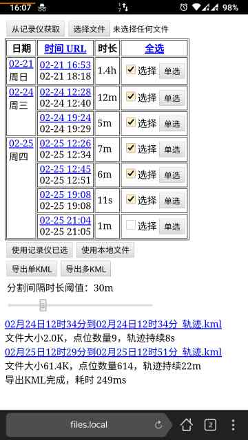

# 导出记录仪中的轨迹到KML文件

## 使用方法

- PC端Chrome浏览器（Android则使用Yandex）安装[CORS扩展](https://mybrowseraddon.com/access-control-allow-origin.html)（跨站请求）
- 启用CORS扩展中的```Access-Control-Allow-Headers, Access-Control-Allow-Credentials, Access-Control-Allow-Origin:*```标志，用于篡改服务器repsonse头部
- 连接记录仪WiFi
- 打开网页，勾选合适的时间段，下载GPS轨迹

由于Chrome等现代浏览器对跨站预检较严，必须安装CORS扩展才能正确收到记录仪的HTTP回复。

## 截图


