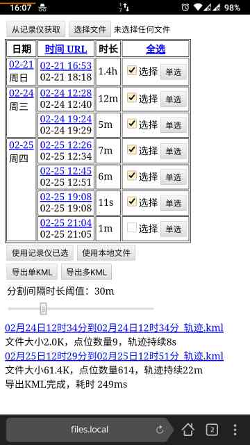
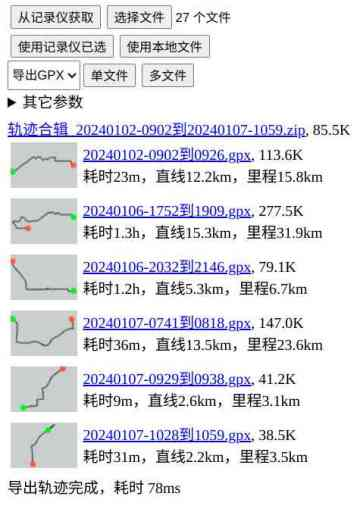

# 导出记录仪中的轨迹到KML/GPX文件

将本项目部署到某虚拟主机上，可以是github.io静态展示页，访问index.html即可。

用到的第三方库

- [jQuery](https://jquery.com)
- [fast-xml-parser](https://github.com/NaturalIntelligence/fast-xml-parser)
- [uncompress.js](https://github.com/workhorsy/uncompress.js)
- [jszip.js](https://github.com/Stuk/jszip) tag: v2.5.0

## 导出方法

GPS轨迹原始数据源，可以是从记录仪中直接获取，也可以打开本地gpx/git文件，提供给前端脚本处理。这两种方法都可以导出轨迹，只使用一种即可。

注意：

- 本地gpx是指USB连接记录仪拷贝出来的文件，是固定大小的纯文本，不是真正的GPX/XML格式。
- 本地git是指USB连接记录仪拷贝出来的文件，本身是tar格式压缩包，内含多个gpx文件。

### 从记录仪中获取轨迹文件

- PC端Chrome浏览器（Android端可用Firefox或者Yandex）安装[CORS扩展](https://mybrowseraddon.com/access-control-allow-origin.html)（跨站请求）
- 启用CORS扩展中的```Access-Control-Allow-Headers, Access-Control-Allow-Credentials, Access-Control-Allow-Origin:*```标志，用于篡改服务器repsonse头部
- 打开网页（因为下一步连接WiFi后就没网了）
- 连接记录仪WiFi
- 点击中间按钮：从记录仪获取，此时会显示记录仪有效轨迹的时间段
- 勾选合适的时间段，点击：使用记录仪已选，开始从记录仪下载原始数据
- 提示下载完毕后，可以点击导出KML按钮，导出KML轨迹

由于Chrome等现代浏览器对跨站预检较严，必须执行以下步骤，方可收到记录仪的HTTP回复：

- 安装CORS扩展
- 部署的网站访问使用http协议，而不是https

### 使用本地文件

此方法适用于已经有大段大段的数据（如长时间、长途轨迹的合集）

- 无需连接记录仪WiFi，只需准备好gpx/git文件到某一个目录下（gpx/git请保持原文件名）
- 打开网页
- 点击上方按钮：选择git和gpx文件（支持多选）
- 点击中间按钮：使用本地文件，开始从本机下载原始数据
- 提示下载完毕后，可以点击导出KML按钮，导出KML轨迹

## 其它功能

- 从记录仪获取原始数据后，可以在表格中单击时间一列，获得多个gpx/git文件的http下载直链
- 设置盯盯拍停机时间超过一定时间阈值后，才分割成两条轨迹导出
- 下载轨迹前，可以从小窗口预览记录仪的轨迹（含起点终点信息）
- 合并轨迹下载（打包成zip文件）
- 内置了GPX与KML文件格式相互转换，访问```convert.html```可批量转换多个轨迹文件

## 截图

|从记录仪下载|从本机上传git/gpx文件|
|--|--|
|||

## 工作原理

- 盯盯拍记录仪提供了无线局域网接入点和HTTP服务器，连接该WiFi后，经过App抓包，可以观察到API地址```http://193.168.0.1/cmd.cgi?cmd=API_GpsFileListReq```返回的是最近的GPS轨迹记录。也有网友对其抓包分析，如[这个博客](https://www.eionix.co.in/2019/10/10/reverse-engineer-ddpai-firmware.html)列出了几乎所有的API和使用VLC播放串流
- 每段gps记录是gpx文件（纯文本）或者git文件（tar压缩包，内含多个gpx），对应了U盘内的同名文件
- gpx文件中以```$GPRMC```和```$GPGGA```开头的字段为GPS记录，参考[GPS-NMEA文档](http://aprs.gids.nl/nmea/)即可解析出每一个时刻对应的GPS位置（WGS84坐标系）
- 参考[KML格式文档](https://developers.google.com/kml/documentation/kmlreference)即可导出完整的KML文件，可以在[Google Earth](https://earth.google.com/web/)中验证轨迹正确性
- 参考[GPX格式文档](https://wiki.openstreetmap.org/wiki/GPX)，并在OpenStreetMap中上传私人轨迹，以验证轨迹正确性。

以上就是大致原理，可以根据基本原理做出简单的App，实现参数控制、回放视频等功能。鉴于精力有限，仅实现了基本的轨迹导出功能。

## 其它笔记

- ```API_GpsFileListReq```这个返回的json中的时间戳格式并不是GMT+0，而是GMT+8，可能是固件开发者把偏移写死了，需要手动调整为GMT+0